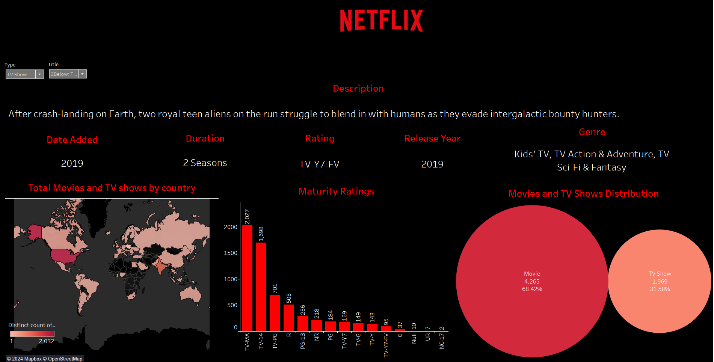
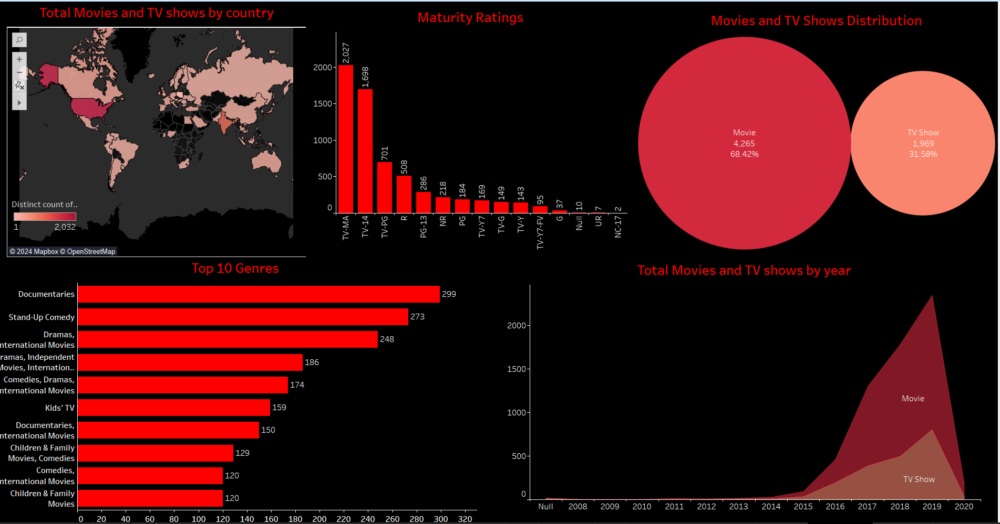
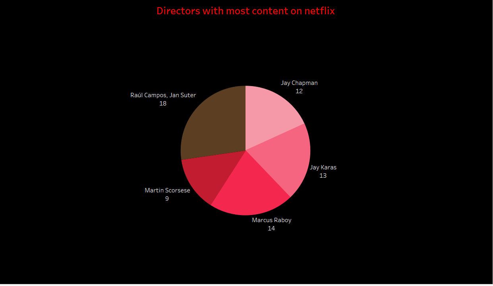
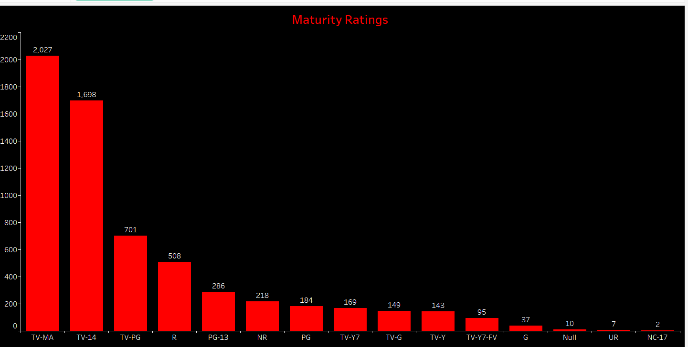
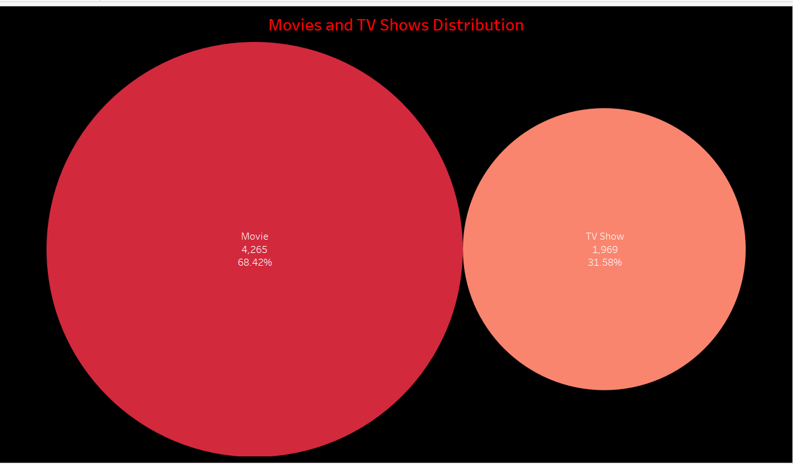
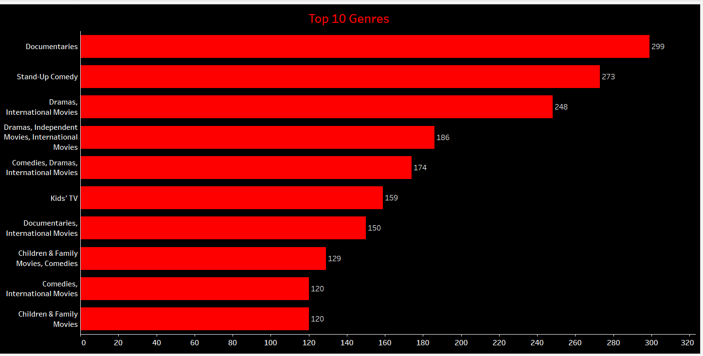
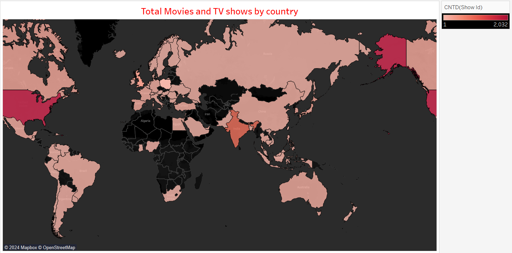
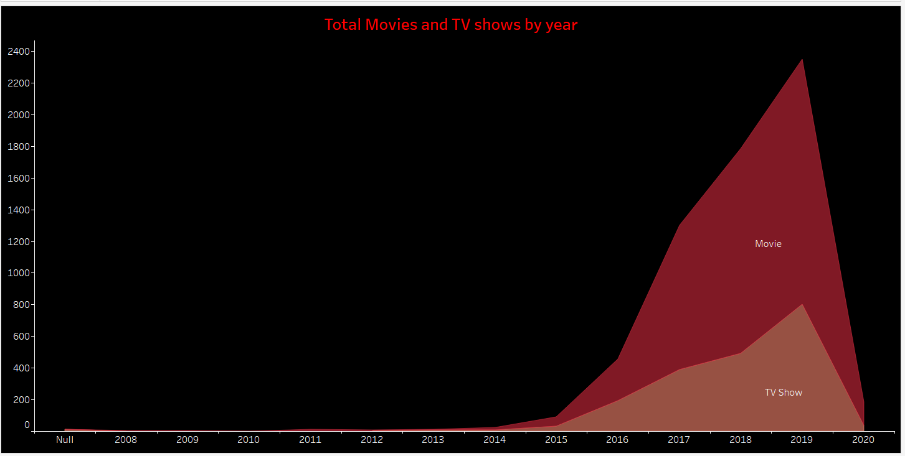

# 🎬 Dynamic Netflix Dashboard (Tableau)

This project presents an interactive **Netflix content dashboard** built using **Tableau**. It provides insights into Netflix’s vast content library, exploring trends across countries, genres, ratings, and content types.

---

## 📂 Project Overview

The dataset was sourced from a publicly available Netflix dataset and cleaned using **Excel**. Tableau was used to build a dynamic and visually appealing dashboard that allows users to explore patterns in Netflix’s global content distribution, genre trends, and maturity ratings.

---

## 📊 Dashboard Features

### 🔹 Interactive Title Search
- Filter any movie or TV show title.
- View detailed description, release year, duration, and genre instantly.

### 🔹 Content Distribution by Country
- World map visualization showing the total number of titles available by country.
- Helps analyze Netflix’s regional content strategy.

### 🔹 Maturity Ratings Breakdown
- Bar chart showing how content is distributed across different maturity levels.
- Useful to understand age-appropriateness of content.

### 🔹 Movies vs TV Shows Split
- Bubble chart representing the ratio between movies and TV shows.
- Highlights that movies make up ~68% of Netflix content.

### 🔹 Genre Popularity
- Horizontal bar chart showing the **Top 10 most common genres**.
- Combines multiple genre tags for richer insights.

### 🔹 Time-Based Trends
- Area chart visualizing the total content added year-over-year.
- Differentiates between movies and TV shows to spot content growth trends.

---

## 🧪 Data Preparation

- 📥 Data cleaned in Excel (null value removal, genre separation, type normalization).
- 🧮 Created calculated fields in Tableau (e.g., distinct count by country, genre groupings).
- 🗂️ Filter options added for dynamic exploration (title, type, genre).
- 🌍 Used **Mapbox** and **color encodings** for visual clarity.

---

## 📁 Files Included

- `Netflix analysis.twbx` — Tableau packaged workbook  
- `README.md` — This documentation file  
- `DASHBOARD1.png` & `DASHBOARD2.png` — Preview images of dashboards  
- `TOTAL MOVIES AND TV SHOWS BY COUNTRY.png`  
- `MATURITY RATINGS.png`  
- `MOVIES AND TV SHOWS DISTRIBUTION.png`  
- `TOP 10 GENRES.png`  
- `TOTAL MOVIES AND TV SHOWS BY YEAR.png`  
- `DIRECTORS WITH MOST CONTENT ON NETFLIX.png`  

---

## 🚀 How to View

1. Download the `.twbx` file.
2. Open it using [Tableau Public (Free)](https://public.tableau.com/s/download) or Tableau Desktop.
3. Interact with filters, maps, and charts for deeper insights.

---

## 📌 Key Tools Used

- **Tableau** (Maps, Filters, Calculated Fields, Charts)
- **Excel** (Data Cleaning and Preprocessing)

---

## 🔐 Data Privacy

> 🛡️ This dashboard is based on publicly available Netflix metadata. No personally sensitive or copyrighted video content is included.

---

## 📷 Dashboard Previews

### 🔸 Main Dashboards
  
  

### 🔸 Insights Visualizations
**Directors with Most Content on Netflix**  
  

**Maturity Ratings**  
  

**Movies and TV Shows Distribution**  
  

**Top 10 Genres**  
  

**Total Movies and TV Shows by Country**  
  

**Total Movies and TV Shows by Year**  
  

---

## ✍️ Author

**Aditya BG**  
3rd Year CSE Student — Dayananda Sagar College of Engineering  
Email: _[Your Email]_  
LinkedIn: _[Your LinkedIn link]_

---
